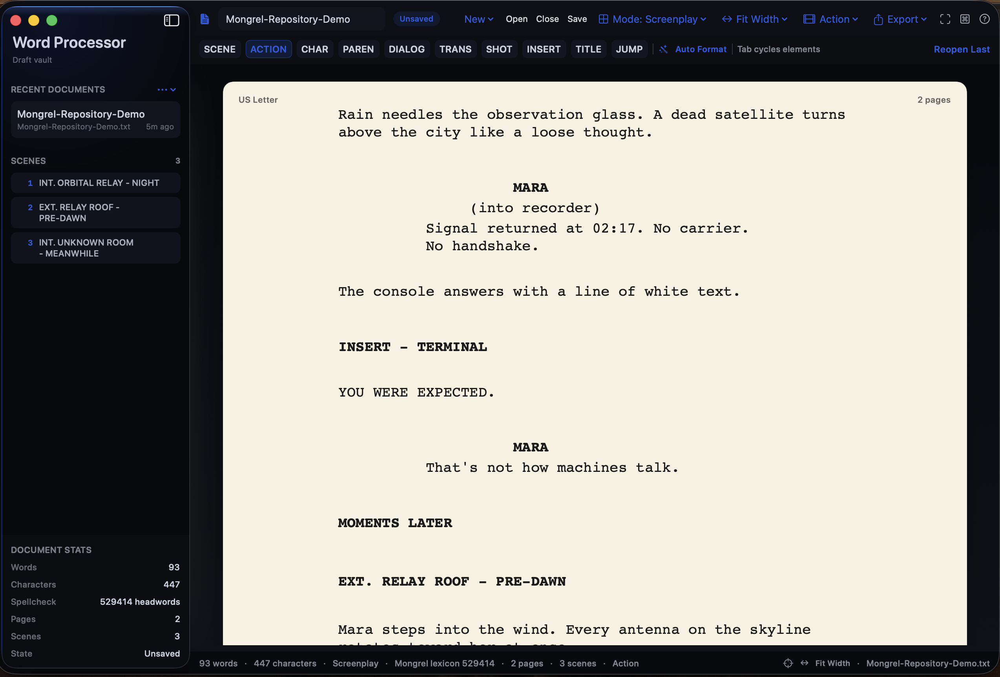
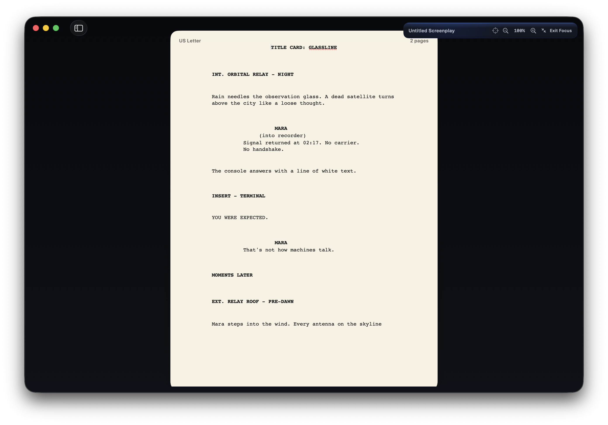

# Mongrel Word Processor

A native macOS writing environment that treats prose and screenplays as first-class documents. Mongrel Word Processor is an in-progress, source-visible member of the Mongrel suite, built for local work rather than an account, cloud, or App Store funnel.



## What works

- Native prose, code, and screenplay authoring modes.
- Mixed-mode workspace tabs for keeping prose, screenplay, and code projects live together.
- Autosave-on-tab-switch for named files, plus versioned local workspace recovery for untitled and dirty tabs.
- True US Letter screenplay pages with live page and scene counts.
- Scene heading, action, character, parenthetical, dialogue, transition, shot, insert/title card, and time-jump elements.
- Contextual screenplay suggestions, Tab/Shift-Tab element cycling, and whole-document auto-formatting.
- A scene navigator that jumps directly to detected headings.
- A Save As Type menu for native Mongrel files, RTF/RTFD, DOCX, source code, and plain text.
- Native `.mongreldoc` prose masters that retain page colors, headers, footers, attachments, and mode metadata.
- Native `.mgscreenplay` files that retain semantic screenplay elements other formats cannot preserve.
- PDF, DOCX, RTF, and plain-text export.
- Focus and typewriter modes, zoom controls, recent documents, and a command palette.
- Standard, high-contrast, and custom color viewing modes.
- Document insights for reading time, paragraph rhythm, sentence density, scene weight, dialogue share, and character cue counts.
- App-managed OpenType and TrueType font installation, using local font files whose licenses permit use.
- Offline macOS spelling and grammar with a bundled Mongrel Dictionary companion lexicon, plus an optional local LanguageTool check.



## Stack

| Layer | Technology |
|---|---|
| Language | Swift 5.9 |
| Text engine | TextKit 2 (`NSTextView` and `NSTextLayoutManager`) |
| UI | SwiftUI and AppKit |
| Project generation | XcodeGen |
| Platform | macOS 14+, Apple silicon |

## Build

Open `MongrelWordProcessor/MongrelWordProcessor.xcodeproj`, select the `MongrelWordProcessor` scheme, and run. The visual foundation needed by the app is included under `MongrelWordProcessor/Packages/SharedFoundation`, so a clone does not depend on another Mongrel repository.

To regenerate the project after changing `project.yml`:

```bash
cd MongrelWordProcessor
xcodegen generate
```

Run the automated suite with:

```bash
cd MongrelWordProcessor
xcodebuild test \
  -project MongrelWordProcessor.xcodeproj \
  -scheme MongrelWordProcessor \
  -destination 'platform=macOS' \
  CODE_SIGNING_ALLOWED=NO
```

## Dictionary companion

The bundled lexicon allows comprehensive offline spellcheck without absorbing the Dictionary app into this repository. When the Dictionary project produces a newer companion export, import it with:

```bash
./Scripts/import-dictionary-companion.sh
```

The app uses the system spellchecker for editor integration and augments it with 529,414 Mongrel Dictionary headwords. Hunspell's source tree is therefore not bundled: the engine alone does not provide a dictionary, while embedding another native spelling stack would duplicate working offline behavior.

## Formats

No single format wins every game:

| Format | Best use | Tradeoff |
|---|---|---|
| `.mongreldoc` | Prose or code master with Mongrel layout | Mongrel-specific outside the app |
| `.mgscreenplay` | Screenplay master | Mongrel-specific outside the app |
| `.rtf` | Portable editable prose | Less universal than DOCX in office workflows |
| `.docx` | Sharing with Word and other suites | Conversion can alter advanced layout or app-specific semantics |
| `.txt` | Code, notes, archival portability | No typography, styles, or screenplay metadata |
| `.pdf` | Fixed-layout delivery and review | Not an authoring format |

Keep prose masters with native layout as `.mongreldoc` and screenplay masters as `.mgscreenplay`; use DOCX, RTF, TXT, or PDF as interchange and delivery copies.

## Fonts and local grammar

Use **Writing > Install Font Files** to copy `.otf` or `.ttf` files into the app's private font library. Mongrel registers them locally on launch rather than silently installing them system-wide. Font licenses still apply, and recipients need the same font unless the delivery format embeds it.

The Writing Tools panel can query a LanguageTool server at `http://127.0.0.1:8081/v2/check`. This keeps text on the Mac and keeps LanguageTool's Java runtime out of the application bundle. Install a standalone LanguageTool release, start its local HTTP server on port 8081, then run the check from Mongrel. The upstream source checkout is useful for development, but it is not itself a distributable server binary.

## Status

This is development software, not a finished release. File creation, mixed-mode tabs, workspace recovery, saving, RTF and DOCX round trips, screenplay semantics, pagination, export, accessibility palettes, and editor integration have automated coverage. Destructive editing and unusual import files still deserve real-world testing before a public beta binary.

The source is currently viewable, but no open-source license has been granted yet.
