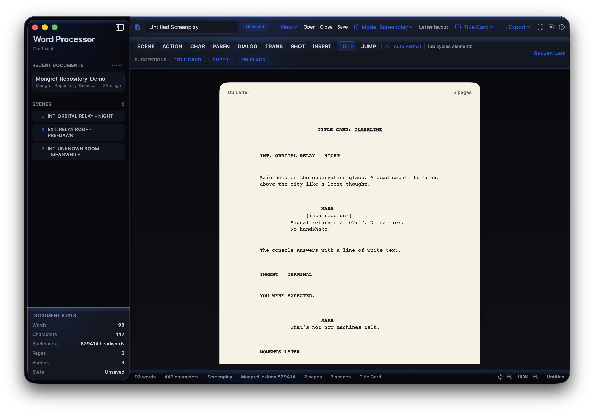

# Mongrel Word Processor

A native macOS writing environment that treats prose and screenplays as first-class documents. Mongrel Word Processor is an in-progress, source-visible member of the Mongrel suite, built for local work rather than an account, cloud, or App Store funnel.



## What works

- Native prose, code, and screenplay authoring modes.
- True US Letter screenplay pages with live page and scene counts.
- Scene heading, action, character, parenthetical, dialogue, transition, shot, insert/title card, and time-jump elements.
- Contextual screenplay suggestions, Tab/Shift-Tab element cycling, and whole-document auto-formatting.
- A scene navigator that jumps directly to detected headings.
- Native `.mgscreenplay` files that retain semantic screenplay elements, plus RTF and plain-text opening and saving.
- PDF, RTF, and plain-text export.
- Focus and typewriter modes, zoom controls, recent documents, and a command palette.
- Standard, high-contrast, and custom color viewing modes.
- Offline spellchecking with a bundled Mongrel Dictionary companion lexicon. The full Dictionary app remains a separate install and integration target.


## Stack

| Layer | Technology |
|---|---|
| Language | Swift 5.9 |
| Text engine | TextKit 2 (`NSTextView` and `NSTextLayoutManager`) |
| UI | SwiftUI and AppKit |
| Project generation | XcodeGen |
| Platform | macOS 14+, Apple silicon |

## Build

Open `MongrelWordProcessor/MongrelWordProcessor.xcodeproj`, select the `MongrelWordProcessor` scheme, and run. The visual foundation needed by the app is included under `MongrelWordProcessor/Packages/SharedFoundation`, so a clone does not depend on another Mongrel repository.

To regenerate the project after changing `project.yml`:

```bash
cd MongrelWordProcessor
xcodegen generate
```

Run the automated suite with:

```bash
cd MongrelWordProcessor
xcodebuild test \
  -project MongrelWordProcessor.xcodeproj \
  -scheme MongrelWordProcessor \
  -destination 'platform=macOS' \
  CODE_SIGNING_ALLOWED=NO
```

## Dictionary companion

The bundled lexicon allows comprehensive offline spellcheck without absorbing the Dictionary app into this repository. When the Dictionary project produces a newer companion export, import it with:

```bash
./Scripts/import-dictionary-companion.sh
```

## Status

This is development software, not a finished release. File creation, saving, reopening, screenplay semantics, pagination, export, accessibility palettes, and editor integration have automated coverage. Destructive editing and unusual import files still deserve real-world testing before a public beta binary.

The source is currently viewable, but no open-source license has been granted yet.
